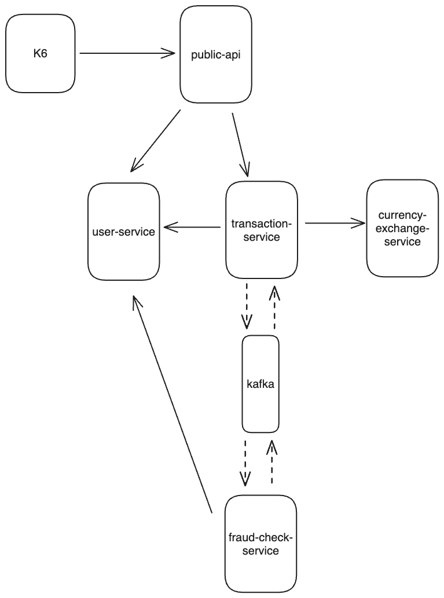

# Observability Workshop
Goal - try out observability tools with a simple distributed system inplemented in kotlin

## Technology Used
- Kotlin
- Http4k
- OpenTelemetry
- PostgreSQL
- Kafka
- Grafana
- Tempo
- Loki

## How to run
- Run from current dirrectry with `docker compose up`
- Navigate to `http://localhost:3000/` to see the grafana dashboard

## Architecture

## What is implemented for Observability
- 2 dashboards: Service Health and JVM Metrics and Business Metrics
- Each dashboard has exemplars feature enabled - you will see dots in the charts. Clicking on them will open a side panel with more details and link to corresponding traces.
- Traces have logs connections - expanding span will show a link that shows corresponding logs.

## Issues
- Setup is "chatty": OpenTelementry is not configured to skip redundant spans, so you will see, for example a span from jetty following up by span from http4k. Span from jetty will not be accessable from code, so no custom attributes or events.
- Kafka connection for some reason is not displayed in spans how it should be. Following semantic conventions, kafka consumer should create new trace on each poll, with events having links to parent spans via links. For some reason it does not work, and kafka puts consumer span as child span of producer span.